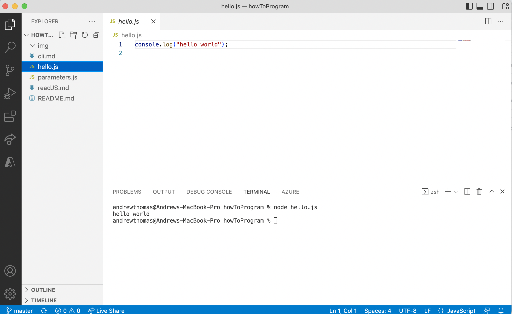

# How to program in JavaScript

# setup 
[install node](https://nodejs.org/en/download/)   
[install visual studio community](https://visualstudio.microsoft.com/vs/community/)

## lessons
1. read the  [command line interface faq](cli.md) 
2. read [javascript fundamental constructs](readJS.md)

## example programs
1. run hello.js  
`node hello.js`
2. run parameters.js - illustrates that primitive function parameters are copied and objects are passed by reference.  
`node parameters.js`

